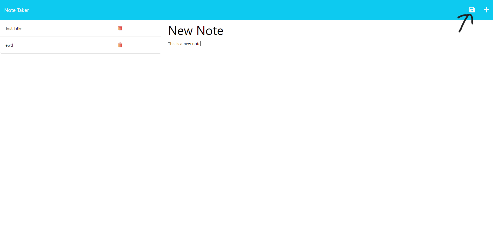

# My planner
          
## Table of Content 
- [Project Description](#Description)
- [Usage](#Usage)
- [Contribution](#Contribution)
- [Installation](#Installation)
- [Tests](#Tests)
- [Questions](#Questions)
- [Email](#Email)
- [Github](#Github)
## Description
This project was created so the user can record and store information to help them complete day to day tasks. User can give their notes a title and further describe what needs to be completed for the task. This app helps the user stay on task and feel accomplished at the end of the day.The app is deployed on Heroku.
## Usage
 This app is deployed in Heroku
- User will access the site
- Write a title under after clicking on "Note Title"
- Write notes under "Note Text"
- Click the save button on the top right to save the note.

## Contributing
Tiffany Anglero
## Installation
Live link on Heroku: https://my-planner.herokuapp.com/notes

## Tests

## Questions 

Email: tiffanyanglero94@hotmail.com

GitHub: https://github.com/https://github.com/tanglero4?tab=repositories   
